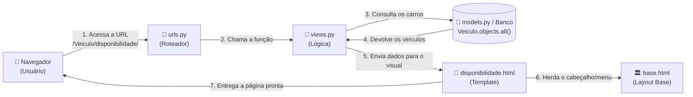

# 📚 Guia de Estudos — História #55: Registro de Disponibilidade de Veículo
**Projeto:** RotaSaúde (Django & Bootstrap 5)  
**Aluna:** Geise Silva — Curso de Desenvolvimento de Software Multiplataforma (DSM)  

---

## 🧭 1. Como o Django Funciona (O Padrão MVT)

No Django, tudo funciona como uma linha de produção organizada chamada **MVT (Model - View - Template)**:



1. **URL (`urls.py`):** É a placa de trânsito. O navegador pede uma página e a URL diz para onde essa requisição deve ir.
2. **View (`views.py`):** É o cérebro da operação. Ela busca os dados no banco de dados e decide o que fazer.
3. **Model (`models.py`):** É o mapa do banco de dados (onde estão guardados os veículos cadastrados).
4. **Template (`disponibilidade.html`):** É a casca visual (o HTML bonito que a pessoa enxerga na tela).
5. **Base (`base.html`):** O esqueleto comum a todas as páginas (menu superior, logotipo e rodapé).

---

## 🗂️ 2. Mapa dos Arquivos Criados e Modificados

| # | Arquivo | O que é | Status | Para que serve |
|---|---|---|---|---|
| **1** | `docs/prototipos/prototipo_disponibilidade.html` | Protótipo Visual | **Criado** | Tela interativa de simulação para validação (Tarefa 1). |
| **2** | `docs/design/ADR-013-disponibilidade-veiculo.md` | Documento de Decisão | **Criado** | Registro arquitetural formal explicando as regras de negócio. |
| **3** | `Veiculo/templates/Veiculo/disponibilidade.html` | Template Django Oficial | **Criado** | A tela real renderizada pelo Django no sistema (Tarefa 2). |
| **4** | `Veiculo/views.py` | Lógica da Aplicação | **Modificado** | Função que busca veículos no banco e processa o envio da tela. |
| **5** | `Veiculo/urls.py` | Rota / Endereço | **Modificado** | Define o link `/Veiculo/disponibilidade/`. |
| **6** | `Veiculo/templates/Veiculo/base.html` | Menu Principal | **Modificado** | Adiciona o botão "Disponibilidade" no menu do topo. |

---

## 🔍 3. Detalhamento Linha por Linha de Cada Arquivo

---

### Arquivo 1: `Veiculo/templates/Veiculo/disponibilidade.html`
**Caminho completo:** `RotaSaude/Veiculo/templates/Veiculo/disponibilidade.html`  
**O que é:** O template HTML oficial da nova tela.

#### Trechos mais importantes explicados:
```html

```
> **O que faz:** Herança de template. Avisa ao Django para reaproveitar todo o cabeçalho, a barra de navegação verde e o rodapé do arquivo `base.html`.

```html

<div class="alert alert-success ...">
  <strong>Sucesso!</strong> A disponibilidade foi registrada com sucesso na frota.
</div>

```
> **O que faz:** Alerta condicional. Essa caixa verde só aparece na tela se a variável `sucesso` enviada pela View for verdadeira.

```html

<div class="alert alert-danger ...">
  <strong>Não foi possível salvar:</strong> {{ erro }}
</div>

```
> **O que faz:** Alerta condicional de erro. Só aparece se a View avisar que faltou preencher algum campo.

```html
<form method="post" novalidate>
  
```
> **O que faz:** 
> - `method="post"`: Diz que o formulário está enviando dados para serem salvos (não apenas lidos).
> - ``: Trava de segurança obrigatória do Django contra ataques de falsificação de formulário.

```html
<select name="veiculo" id="id_veiculo" class="form-select" required>
  <option value="" selected disabled>Selecione um veículo cadastrado...</option>
  
    <option value="{{ veiculo.id }}">{{ veiculo.placa }} - {{ veiculo.modelo }} ({{ veiculo.capacidade }} lugares)</option>
  
    <option value="" disabled>Nenhum veículo cadastrado na frota.</option>
  
</select>
```
> **O que faz:** 
> - O `` é um laço de repetição. Para cada veículo que veio do banco, ele cria uma linha `<option>` com a placa, modelo e capacidade.
> - O `` só roda se não existir nenhum veículo cadastrado no banco.

---

### Arquivo 2: `Veiculo/views.py`
**Caminho completo:** `RotaSaude/Veiculo/views.py`  
**O que foi adicionado:** A função `disponibilidade_veiculo(request)` no final do arquivo.

```python
def disponibilidade_veiculo(request):
    # 1. Busca todos os veículos salvos no banco de dados SQLite
    veiculos = Veiculo.objects.all()
    sucesso = False
    erro = None

    # 2. Se a requisição for do tipo POST (ou seja, o usuário clicou no botão "Salvar")
    if request.method == "POST":
        # Captura os valores que vieram digitados do formulário
        veiculo_id = request.POST.get("veiculo")
        data = request.POST.get("data")
        horario = request.POST.get("horario")

        # Validação da regra: nenhum campo pode ficar vazio
        if not veiculo_id or not data or not horario:
            erro = "Por favor, preencha todos os campos obrigatórios."
        else:
            sucesso = True

    # 3. Renderiza o template entregando as variáveis para o HTML exibir
    return render(
        request,
        "Veiculo/disponibilidade.html",
        {"veiculos": veiculos, "sucesso": sucesso, "erro": erro},
    )
```

> **Conceitos chave:**
> - `Veiculo.objects.all()`: Comando do Django ORM que faz o equivalente ao SQL `SELECT * FROM veiculo;`.
> - `request.method`: Identifica se a pessoa está apenas abrindo a página (`GET`) ou enviando o formulário (`POST`).
> - `render(request, template, contexto)`: Junta o HTML com os dados do Python e devolve a página pronta para o navegador.

---

### Arquivo 3: `Veiculo/urls.py`
**Caminho completo:** `RotaSaude/Veiculo/urls.py`  
**O que foi adicionado:** A linha que cria o endereço web da tela.

```python
path("Veiculo/disponibilidade/", views.disponibilidade_veiculo, name="disponibilidade_veiculo"),
```

> **O que faz:**
> - `"Veiculo/disponibilidade/"`: O caminho digitado na barra de endereços do navegador (`http://127.0.0.1:8000/Veiculo/disponibilidade/`).
> - `views.disponibilidade_veiculo`: Diz qual função dentro de `views.py` deve responder quando esse endereço for acessado.
> - `name="disponibilidade_veiculo"`: Nome de batismo da rota, permitindo chamá-la em links HTML através de `` sem precisar escrever o endereço na mão.

---

### Arquivo 4: `Veiculo/templates/Veiculo/base.html`
**Caminho completo:** `RotaSaude/Veiculo/templates/Veiculo/base.html`  
**O que foi adicionado:** O item no menu superior de navegação.

```html
<li class="nav-item">
  <a class="nav-link active" href="">Disponibilidade</a>
</li>
```

> **O que faz:**
> - Cria o item clicável "Disponibilidade" na barra superior.
> - O trecho `active` serve para deixar o botão aceso/destacado em branco sempre que você estiver nessa página!

---

### Arquivo 5: `docs/design/ADR-013-disponibilidade-veiculo.md`
**Caminho completo:** `RotaSaude/docs/design/ADR-013-disponibilidade-veiculo.md`  
**O que é:** O documento de arquitetura que registra a decisão de projeto:
- Justifica por que usamos uma lista suspensa de veículos (ADR-002, sem digitação livre).
- Justifica por que não colocamos o campo de vagas (ADR-011, pois a capacidade já é do veículo).
- Justifica a proibição de datas no passado e obrigatoriedade de horário.
- Vincula formalmente à **História #55 do Taiga — Tarefa 01**.

---

### Arquivo 6: `docs/prototipos/prototipo_disponibilidade.html`
**Caminho completo:** `RotaSaude/docs/prototipos/prototipo_disponibilidade.html`  
**O que é:** O protótipo visual independente construído com Bootstrap 5 e Flatpickr, que você abriu diretamente no navegador para testar a tela e tirar os prints da Tarefa 01.

---

## 📖 4. Dicionário de Termos Técnicos para o seu Curso (DSM)

* **WSL (Windows Subsystem for Linux):** Uma ferramenta que roda um sistema operacional Linux (Ubuntu) dentro do seu Windows, permitindo trabalhar com ferramentas de programação de padrão profissional.
* **Ambiente Virtual (`.venv`):** Uma pasta isolada no computador que guarda as bibliotecas do projeto (como o Django) sem misturar com o resto do sistema.
* **ORM (Object-Relational Mapping):** A ferramenta do Django que permite mexer no banco de dados usando código Python (`Veiculo.objects.all()`) em vez de comandos SQL complicados.
* **Template Inheritance (``):** Recurso que evita repetir código de cabeçalho e rodapé em todas as páginas do sistema.
* **CSRF Token:** Código de segurança embutido em formulários para garantir que o envio veio de um usuário legítimo do próprio site.

